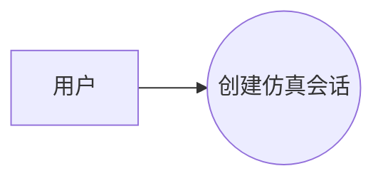
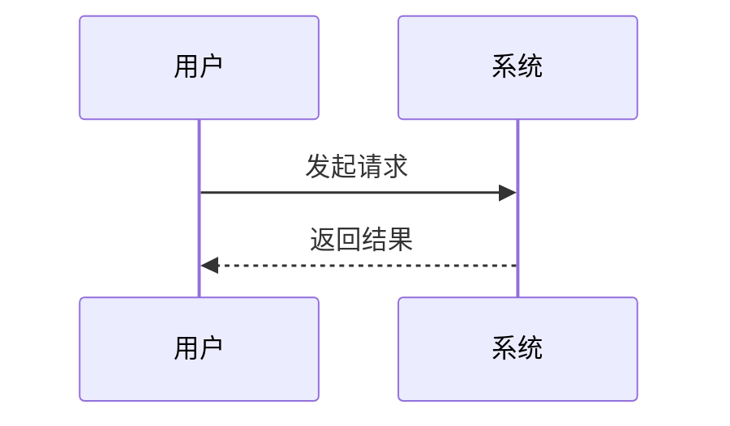

# Huawei TR Doc Skill

一句话生成华为 TR 风格 / IPD 风格阶段设计文档。

> 本仓库用于生成“华为 TR 风格”的设计文档模板与内容，不代表华为内部官方模板，也不输出“评审报告”。默认输出为 **Markdown 文本**。

## 定位

这个仓库是 **模板 + 生成型 skill**。

它不是纯模板填空，也不是完全自由生成，而是：

```text
用户一句话
  -> 判断 TR 阶段
  -> 选择对应模板
  -> 用模板约束章节、表格和 Mermaid 图结构
  -> 用生成逻辑扩写背景、目标、用例、功能、概念方案、风险和下一步
  -> 输出完整 Markdown 设计文档
```

模板的作用是保证 TR1-TR6 的结构稳定、阶段边界清晰；生成逻辑的作用是把一句话扩展成可读、可改、可继续迭代的设计文档。

最终输出不应保留 `{{...}}`、`TODO`、`xxx`、空表格或未完成占位内容。

## 功能

- 支持一句话生成 TR1-TR6 中某一个阶段的设计文档
- 默认输出 Markdown 文本
- 支持 Mermaid 用例图和时序图
- 支持软件、AI Agent、仿真系统、平台型项目
- 自动补齐项目背景、项目目标、用例分析、功能分析、核心方案、风险清单、待确认问题、设计检查表
- 对缺失信息自动标记为“设计假设”或“待确认问题”

## 支持的 TR 设计阶段

| 阶段 | 设计文档名称 | 适用场景 |
|---|---|---|
| TR1 | 产品概念与可行性设计文档 | 项目想法、立项、项目背景、项目目标、用例分析、功能分析、概念可行性分析；不做技术选型 |
| TR2 | 需求分解与规格设计文档 | 需求拆解、规格定义、验收标准、需求追踪 |
| TR3 | 总体方案与概要设计文档 | 系统架构、概要设计、技术路线、模块划分，可开始技术路线比较 |
| TR4 | 详细设计与模块设计文档 | 模块设计、接口设计、数据结构、异常处理、具体技术选型 |
| TR5 | 集成验证与测试设计文档 | 集成测试、验证方案、缺陷闭环、质量门禁 |
| TR6 | 发布交付与运维设计文档 | 上线发布、交付运维、回滚方案、遗留风险 |

## TR1 必含内容

TR1 设计文档必须包含：

1. 项目背景
2. 项目目标
3. 用例分析
4. 功能分析

其中用例分析必须包含：

- 用户角色表
- 用例清单
- Mermaid 用例图
- 核心用例说明
- Mermaid 时序图

TR1 不应包含具体技术选型。以下内容应放到 TR3/TR4：

- 编程语言
- Web 框架
- 数据库
- 消息队列
- 容器 / 编排方案
- 云服务厂商
- 具体观测框架
- 具体存储中间件

Mermaid 图使用 Markdown 代码块：

````md

````

````md

````

## 使用方式

### 生成单个阶段设计文档

```text
生成 TR1 设计文档：做一个多 Agent 网络通信仿真平台
```

```text
生成 TR3 设计文档：AgentNetworkSimulation 支持 agent 间消息转发、日志追踪和拓扑回放
```

```text
生成 TR6 设计文档：把一句话生成设计文档 skill 发布到 GitHub 并支持团队使用
```

### 指定格式

```text
生成 TR2 设计文档，输出 Markdown 表格多一点，包含需求追踪矩阵
```

```text
生成 TR4 详细设计文档，重点写接口、数据结构、异常处理和日志字段
```

## 仓库结构

```text
huawei-tr-doc-skill/
├── SKILL.md
├── README.md
├── LICENSE
├── docs/
│   └── generation-rules.md
├── templates/
│   ├── tr1.md
│   ├── tr2.md
│   ├── tr3.md
│   ├── tr4.md
│   ├── tr5.md
│   └── tr6.md
└── examples/
    ├── one-sentence-inputs.md
    └── agentnetwork-tr1.md
```

## 一句话输入建议

一句话里最好包含：

```text
<TR阶段> + <项目名称/项目目标> + <核心能力/约束>
```

示例：

```text
生成 TR1 设计文档：开发 AgentNetworkSimulation，用于模拟多 Agent 网络通信、日志追踪和拓扑回放。
```

```text
生成 TR4 设计文档：为 AgentNetworkSimulation 设计统一日志事件模型，支持 session_id、trace_id、channel_id、agent_from、agent_to 和 HTTP 事件追踪。
```

## 设计原则

1. TR1 看项目背景、项目目标、用例分析、功能分析、概念方案和概念可行性，不做技术选型。
2. TR2 看需求完整性、规格可实现性和验收口径。
3. TR3 看总体方案、架构合理性和关键技术路线。
4. TR4 看详细设计、接口、数据结构、集成可实现性和具体技术选型。
5. TR5 看验证设计、测试覆盖、质量门禁和缺陷闭环。
6. TR6 看发布设计、交付运维、回滚方案和风险闭环。

## 输出要求

生成设计文档时应包含：

- 文档信息
- 一句话输入与需求解析
- 项目背景
- 项目目标
- 用例分析
- 功能分析
- 设计范围与非目标
- 关键概念方案设计
- Mermaid 图
- 风险清单
- 待确认问题与闭环计划
- 设计检查表
- 设计结论与下一步

## License

MIT
