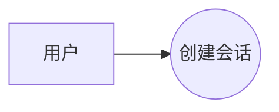
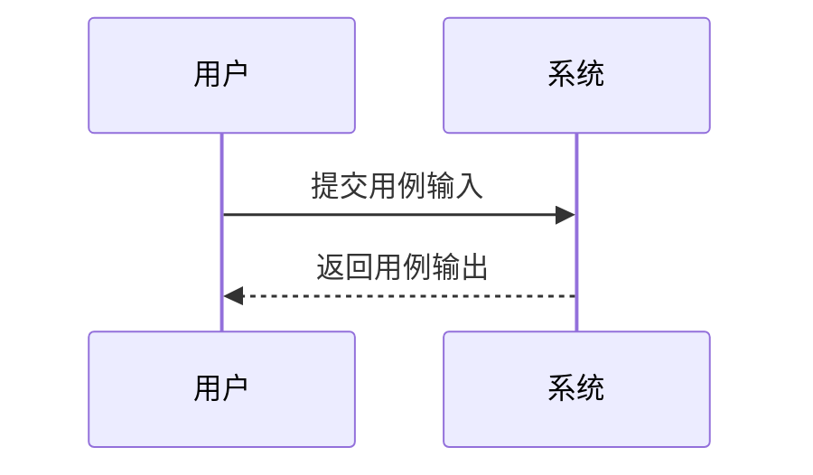

# Huawei TR Doc Skill

一句话生成华为 TR 风格 / IPD 风格阶段设计文档。

> 本仓库用于生成“华为 TR 风格”的设计文档模板与内容，不代表华为内部官方模板。默认输出为 Markdown 文本。

## 定位

本仓库是 **模板 + 生成型 skill**：

```text
用户一句话
  -> 判断 TR 阶段或 TR 文档包
  -> 选择对应模板
  -> 用模板约束章节、表格和 Mermaid 图结构
  -> 用生成逻辑扩写背景、目标、用例、功能、概念方案、风险和下一步
  -> 输出完整 Markdown 设计文档
```

最终输出不应保留 `{{...}}`、`TODO`、`xxx`、空表格或未完成占位内容。

## 支持类型

| 类型 | 模板 | 说明 |
|---|---|---|
| TR1 | `templates/tr1.md` | 产品概念与可行性设计文档 |
| TR2 | `templates/tr2.md` | 需求分解与规格设计文档 |
| TR3 | `templates/tr3.md` | 总体方案与概要设计文档 |
| TR4 | `templates/tr4.md` | 详细设计与模块设计文档 |
| TR5 | `templates/tr5.md` | 集成验证与测试设计文档 |
| TR6 | `templates/tr6.md` | 发布交付与运维设计文档 |
| TR-ALL | `templates/tr-all.md` | TR1-TR6 阶段设计文档包 |

## TR1 必含内容

TR1 设计文档必须包含：

1. 项目背景
2. 项目目标
3. 用例分析
4. 功能分析
5. 设计范围
6. 产品概念设计
7. 概念可行性与实现条件分析
8. 风险清单
9. 设计检查表
10. 设计结论与下一步

## TR1 用例说明固定格式

核心用例说明必须使用以下字段：

| 项目 | 内容 |
|---|---|
| 用户目的 | 用户希望通过该用例达成的目的 |
| 参与人员 | 参与该用例的人、角色或外部系统 |
| 前置条件 | 执行用例前必须满足的条件 |
| 用例输入 | 用户输入、系统输入或触发数据 |
| 用例流程 | 从触发到输出的主要步骤，可使用 `<br>` 表达多步 |
| 用例输出 | 系统输出、用户可见结果或状态变化 |
| 功能调用 | 该用例涉及的功能模块或功能编号，如 FR-001、FR-002 |

## TR1 禁止内容

TR1 不应包含：

- 提示词、原始输入、一句话需求解析、需求解析结果
- 待确认问题章节
- 投入分析 / 资源投入估算
- 具体技术选型
- 代码级接口设计
- 数据库表设计
- 详细部署方案

具体技术选型应放到 TR3/TR4。

## Mermaid 图

TR1 应包含 Mermaid 用例图和时序图。

````md

````

````md

````

## 仓库结构

```text
huawei-tr-doc-skill/
├── SKILL.md
├── README.md
├── LICENSE
├── docs/
│   └── generation-rules.md
├── templates/
│   ├── tr1.md
│   ├── tr2.md
│   ├── tr3.md
│   ├── tr4.md
│   ├── tr5.md
│   ├── tr6.md
│   └── tr-all.md
└── examples/
    ├── one-sentence-inputs.md
    └── agentnetwork-tr1.md
```

## 使用示例

```text
生成 TR1 设计文档：开发一个多角色协作流程仿真平台。
```

```text
生成 TR1-TR6 文档包：开发一个自动生成设计文档的 skill。
```

## License

MIT
