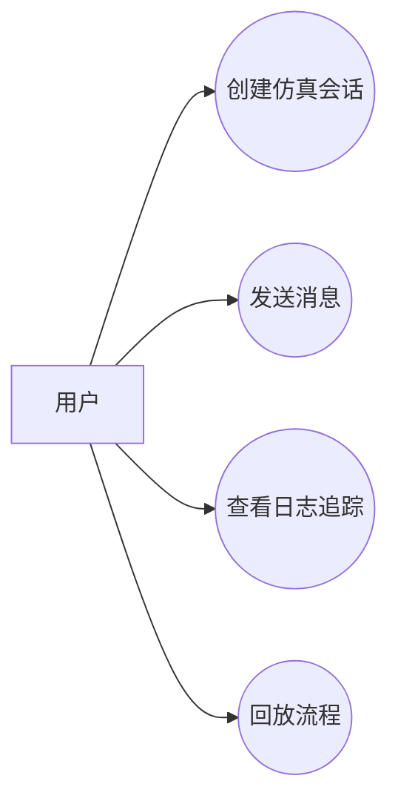
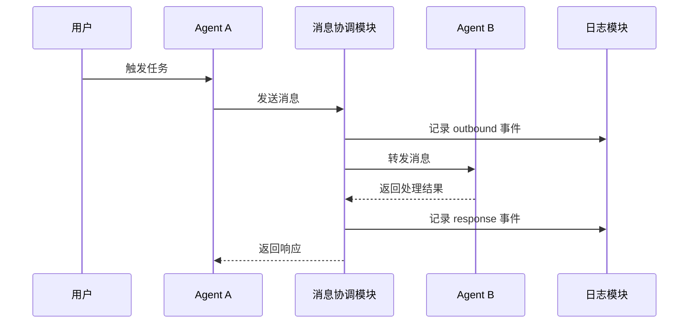

# Huawei TR Design Document Skill

一句话生成华为 TR 风格 / IPD 风格阶段设计文档。

> 说明：本 skill 参考公开资料中常见的 TR1-TR6 阶段关注点组织设计文档，不代表华为内部官方模板；输出物是 **Markdown 文本格式的设计文档**，不是评审报告。

## 核心定位

本 skill 是 **模板 + 生成型 skill**。

- **模板层**：由 `templates/` 提供 TR1-TR6 的章节结构、阶段边界、表格形态、Mermaid 图形要求和必要字段，保证输出统一、完整、可维护。
- **生成层**：根据用户一句话主动抽取、推导、扩写项目内容，生成背景、目标、用例、功能、方案、风险、问题和下一步。

因此，本 skill 不是“只填模板”，也不是“完全自由发挥”。正确行为是：**用模板约束结构，用生成能力补全内容，最终输出 Markdown 文本**。

当用户只给一句话时，必须完成以下工作：

1. 从一句话中抽取项目名称、目标、对象、能力和约束。
2. 根据 TR 阶段选择对应模板。
3. 按模板章节组织输出结构。
4. 对未明确的信息生成合理的“设计假设”。
5. 基于项目类型推导用例、功能、流程、数据、风险和待确认项。
6. 输出一份完整、可阅读、可继续修改的 Markdown 设计文档文本。

禁止只把 `{{占位符}}` 替换为简单文本。禁止在最终文档中保留 `{{...}}`、`待填写`、`xxx`、`TODO` 这类未完成占位内容；确实不确定的信息必须写成“待确认项”或“设计假设”。

## 输出格式

默认输出 **Markdown 文本**。

要求：

- 直接输出 `.md` 内容。
- 使用 Markdown 标题、段落、表格、代码块。
- Mermaid 图必须使用 fenced code block：` ```mermaid `。
- 不默认生成 Word、PDF、PPT、JSON 或 YAML。
- 不只输出目录或字段说明。
- 不把 Markdown 包在 JSON 字段中。
- 如果用户要求保存文件，再生成 `.md` 文件；否则直接在回复中给出 Markdown 文本。

## 适用场景

用户希望根据一句话或简短需求生成某一个 TR 阶段的设计文档时，使用本 skill。

支持阶段：

- TR1：产品概念与可行性设计文档
- TR2：需求分解与规格设计文档
- TR3：总体方案与概要设计文档
- TR4：详细设计与模块设计文档
- TR5：集成验证与测试设计文档
- TR6：发布交付与运维设计文档

本 skill 一次只生成一个阶段的设计文档。

## 阶段判断规则

如果用户没有明确指定 TR 阶段，根据输入语义选择一个阶段：

| 输入倾向 | 默认阶段 |
|---|---|
| 想法、立项、产品概念、可行性 | TR1 |
| 需求、规格、SRS、验收标准 | TR2 |
| 架构、总体方案、概要设计 | TR3 |
| 模块、接口、数据结构、异常处理 | TR4 |
| 测试、集成、验证、质量门禁 | TR5 |
| 发布、上线、交付、运维、回滚 | TR6 |

## 生成流程

### 1. 解析输入

从用户输入中提取：

| 字段 | 说明 |
|---|---|
| 项目名称 | 没有明确名称时，根据核心名词生成临时名称 |
| 项目类型 | 软件系统、平台、工具、AI Agent、仿真系统、数据服务等 |
| 目标用户 | 业务用户、开发者、管理员、测试人员、运维人员等 |
| 核心目标 | 项目要解决的问题 |
| 关键能力 | 主要功能和差异化能力 |
| TR 阶段 | TR1-TR6 中的一个阶段 |
| 约束 | 性能、安全、兼容、部署、成本、时间等 |

### 2. 选择模板

根据 TR 阶段选择模板：

| 阶段 | 模板 | 模板作用 |
|---|---|---|
| TR1 | `templates/tr1.md` | 约束项目背景、项目目标、用例分析、功能分析、概念方案、可行性、Mermaid 图和初始风险结构 |
| TR2 | `templates/tr2.md` | 约束需求分解、规格、验收和追踪矩阵结构 |
| TR3 | `templates/tr3.md` | 约束总体方案、架构、模块和技术路线结构 |
| TR4 | `templates/tr4.md` | 约束详细设计、接口、数据结构和异常处理结构 |
| TR5 | `templates/tr5.md` | 约束验证设计、测试场景、质量门禁结构 |
| TR6 | `templates/tr6.md` | 约束发布、交付、运维、回滚结构 |

模板是结构契约，不是最终答案。生成时可以增补章节，但不能丢失模板要求的核心章节。

### 3. 生成设计假设

如果用户没有提供足够信息，不要停止生成，也不要只输出问题。应先生成文档，并把合理推断标记为设计假设。

示例：

```md
> 设计假设：系统首期面向研发和测试人员使用，以本地或容器化部署为主，暂不作为公网生产服务。
```

### 4. 扩写设计内容

必须主动扩写以下内容：

- 项目背景和当前问题
- 项目目标和成功标准
- 用例分析，包括用户角色、用例列表、用例图、主流程和异常流程
- 功能分析，包括功能清单、功能优先级、功能边界和初步验收口径
- 设计范围和非目标
- 阶段对应的关键设计方案
- 技术可行性或实现可行性
- 风险清单
- 待确认问题与闭环计划
- 设计检查表
- 设计结论与下一步

### 5. 用模板约束，不照抄模板

`templates/` 目录提供章节骨架。生成文档时必须把模板扩写成完整内容。

最终输出不得包含：

- `{{项目名称}}`
- `{{说明}}`
- `{{待确认}}`
- `TODO`
- `xxx`
- 空表格

如果某项无法确定，写成具体的待确认问题，例如：

```md
| Q-001 | 首期最大 agent 数量尚未明确 | 影响性能目标和部署设计 | 产品 / 技术负责人 | TR2 前关闭 |
```

## TR1 专项要求

TR1 设计文档必须包含以下核心章节：

1. 项目背景
2. 项目目标
3. 用例分析
4. 功能分析

其中：

- **项目背景**：说明为什么要做、当前问题、目标用户痛点和业务 / 技术价值。
- **项目目标**：说明总体目标、阶段目标、成功标准和非目标。
- **用例分析**：必须包含用户角色表、用例清单、核心用例说明、Mermaid 用例图、至少一个核心时序图。
- **功能分析**：必须包含功能清单、功能优先级、功能边界、输入输出和初步验收口径。

### TR1 Mermaid 图要求

TR1 输出中必须包含：

#### 1. 用例图

用 Mermaid `flowchart` 表达用例图。



#### 2. 时序图

用 Mermaid `sequenceDiagram` 表达核心流程。



## 默认文档结构

```md
# <项目名称> <TRx> <阶段名称>设计文档

## 1. 文档信息
## 2. 一句话输入与需求解析
## 3. 项目背景
## 4. 项目目标
## 5. 用例分析
## 6. 功能分析
## 7. 设计范围与非目标
## 8. 产品概念设计
## 9. 技术可行性设计分析
## 10. 风险清单
## 11. 待确认问题与闭环计划
## 12. 设计检查表
## 13. 设计结论与下一步
```

## TR 阶段关注点

| 阶段 | 设计重点 | 生成深度 |
|---|---|---|
| TR1 | 项目背景、项目目标、用例分析、功能分析、概念方案、可行性、初始风险 | 概念级，不写代码级细节 |
| TR2 | 需求分解、规格定义、验收口径、追踪关系 | 规格级，强调可验收 |
| TR3 | 总体技术方案、系统架构、概要设计、关键技术路线 | 架构级，强调边界和模块 |
| TR4 | 模块接口、数据结构、异常处理、集成方案 | 详细级，强调可编码 |
| TR5 | 验证设计、测试方案、质量门禁、缺陷闭环 | 验证级，强调可测试 |
| TR6 | 发布方案、交付方案、运维方案、回滚方案 | 交付级，强调可上线和可运维 |

## 质量要求

- 默认使用中文和 Markdown 文本。
- 标题必须是“设计文档”，不要写成“评审报告”。
- 一次只生成 TR1-TR6 中的一个阶段。
- 必须使用对应模板控制结构。
- 必须用生成能力补充具体内容。
- 表格必须有表头，且至少有一行有效内容。
- Mermaid 图必须放在 `mermaid` 代码块中。
- 缺失信息必须转化为“设计假设”或“待确认问题”。
- 输出应像完整文档，而不是字段说明书。

## 自检清单

生成完成后检查：

- [ ] 是否明确了 TR 阶段？
- [ ] 是否选择并遵循了对应模板？
- [ ] 是否输出为 Markdown 文本设计文档？
- [ ] 是否输出为设计文档而不是评审报告？
- [ ] 是否没有保留任何 `{{...}}` 占位符？
- [ ] TR1 是否包含项目背景、项目目标、用例分析、功能分析？
- [ ] TR1 是否包含 Mermaid 用例图和时序图？
- [ ] 是否避免声称华为官方模板？
- [ ] 是否包含设计假设和待确认项？
- [ ] 是否包含阶段对应的设计内容？
- [ ] 是否包含风险清单？
- [ ] 是否包含设计检查表？
- [ ] 是否给出设计结论和下一步？
