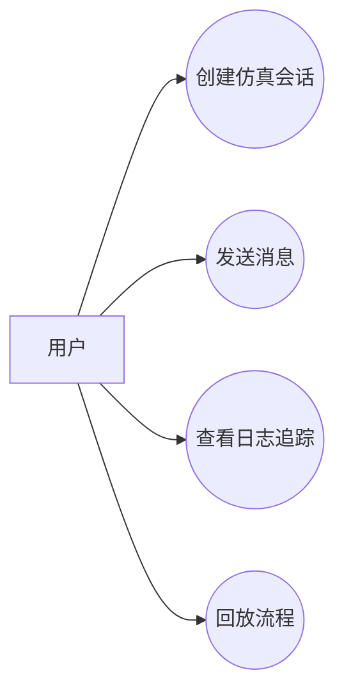
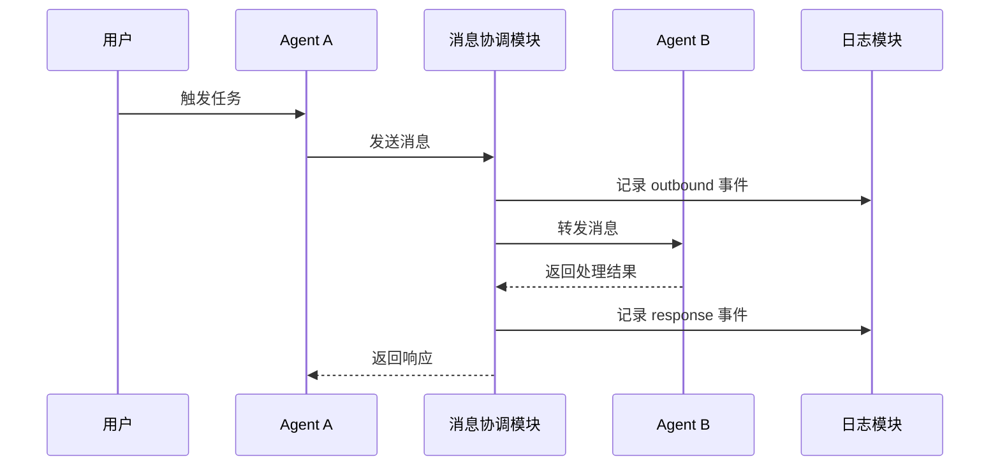

# Huawei TR Design Document Skill

一句话生成华为 TR 风格 / IPD 风格阶段设计文档。

> 说明：本 skill 参考公开资料中常见的 TR1-TR6 阶段关注点组织设计文档，不代表华为内部官方模板；输出物是 **Markdown 文本格式的设计文档**，不是评审报告。

## 核心定位

本 skill 是 **模板 + 生成型 skill**。

- **模板层**：由 `templates/` 提供 TR1-TR6 以及 TR 文档包的章节结构、阶段边界、表格形态、Mermaid 图形要求和必要字段，保证输出统一、完整、可维护。
- **生成层**：根据用户一句话主动抽取、推导、扩写项目内容，生成背景、目标、用例、功能、概念方案、风险和下一步。

正确行为是：**用模板约束结构，用生成能力补全内容，最终输出 Markdown 文本**。

当用户只给一句话时，必须先在内部完成以下生成工作：

1. 从一句话中抽取项目名称、目标、对象、能力和约束。
2. 根据 TR 阶段选择对应模板。
3. 按模板章节组织输出结构。
4. 对未明确的信息生成合理的设计假设或约束说明。
5. 基于项目类型推导用例、功能、流程、边界和风险。
6. 输出一份完整、可阅读、可继续修改的 Markdown 设计文档文本。

注意：**输入解析是内部生成过程，不应作为最终 TR 文档正文的一章输出**。最终文档不应包含“提示词”“原始输入”“一句话需求解析”“需求解析结果”等章节。

禁止只把 `{{占位符}}` 替换为简单文本。禁止在最终文档中保留 `{{...}}`、`待填写`、`xxx`、`TODO` 这类未完成占位内容；确实不确定的信息应写成“设计假设”“约束说明”或“风险”。

## 输出格式

默认输出 **Markdown 文本**。

要求：

- 直接输出 `.md` 内容。
- 使用 Markdown 标题、段落、表格、代码块。
- Mermaid 图必须使用 fenced code block：` ```mermaid `。
- 不默认生成 Word、PDF、PPT、JSON 或 YAML。
- 不只输出目录或字段说明。
- 不把 Markdown 包在 JSON 字段中。
- 如果用户要求保存文件，再生成 `.md` 文件；否则直接在回复中给出 Markdown 文本。

## 适用场景

用户希望根据一句话或简短需求生成某一个 TR 阶段设计文档，或生成 TR1-TR6 阶段设计文档包时，使用本 skill。

支持类型：

- TR1：产品概念与可行性设计文档
- TR2：需求分解与规格设计文档
- TR3：总体方案与概要设计文档
- TR4：详细设计与模块设计文档
- TR5：集成验证与测试设计文档
- TR6：发布交付与运维设计文档
- TR-ALL：TR1-TR6 阶段设计文档包

## 阶段判断规则

| 输入倾向 | 默认模板 |
|---|---|
| 想法、立项、产品概念、可行性 | TR1 |
| 需求、规格、SRS、验收标准 | TR2 |
| 架构、总体方案、概要设计、技术路线 | TR3 |
| 模块、接口、数据结构、异常处理、技术选型 | TR4 |
| 测试、集成、验证、质量门禁 | TR5 |
| 发布、上线、交付、运维、回滚 | TR6 |
| 全套、文档包、TR1-TR6、完整 TR | TR-ALL |

## 模板选择

| 阶段 | 模板 | 模板作用 |
|---|---|---|
| TR1 | `templates/tr1.md` | 约束项目背景、项目目标、用例分析、功能分析、设计范围、概念方案、概念可行性、Mermaid 图和初始风险结构 |
| TR2 | `templates/tr2.md` | 约束需求分解、规格、验收和追踪矩阵结构 |
| TR3 | `templates/tr3.md` | 约束总体方案、架构、模块和技术路线结构 |
| TR4 | `templates/tr4.md` | 约束详细设计、接口、数据结构、异常处理和技术选型结构 |
| TR5 | `templates/tr5.md` | 约束验证设计、测试场景、质量门禁结构 |
| TR6 | `templates/tr6.md` | 约束发布、交付、运维、回滚结构 |
| TR-ALL | `templates/tr-all.md` | 约束 TR1-TR6 完整阶段文档包结构，保持各阶段边界清晰 |

模板是结构契约，不是最终答案。生成时可以增补章节，但不能丢失模板要求的核心章节。

## TR1 专项要求

TR1 设计文档必须包含以下核心章节：

1. 项目背景
2. 项目目标
3. 用例分析
4. 功能分析
5. 设计范围
6. 产品概念设计
7. 概念可行性与实现条件分析
8. 风险清单
9. 设计检查表
10. 设计结论与下一步

其中：

- **项目背景**：说明为什么要做、当前问题、目标用户痛点和业务 / 技术价值。
- **项目目标**：说明总体目标、阶段目标、成功标准和非目标。
- **用例分析**：必须包含用户角色表、用例清单、核心用例说明、Mermaid 用例图、至少一个核心时序图。
- **功能分析**：必须包含功能清单、功能优先级、功能边界、输入输出和初步验收口径。
- **设计范围**：说明范围内、范围外、边界和约束。
- **产品概念设计**：说明系统概念、核心流程、上下文关系和概念方案。
- **概念可行性**：判断需求、用户价值、范围、实现条件和验证方式是否成立。

### TR1 禁止事项

TR1 不应包含：

- 提示词、原始输入、一句话需求解析、需求解析结果
- 待确认问题章节
- 投入分析 / 资源投入估算
- 具体技术选型
- 代码级接口设计
- 数据库表设计
- 详细部署方案

不得在 TR1 中确定或推荐：

- 编程语言
- Web 框架
- 数据库
- 消息队列
- 容器 / 编排方案
- 云服务厂商
- 具体观测框架
- 具体存储中间件

TR1 可以写“概念可行性”“实现条件”“约束说明”“后续需在 TR3/TR4 明确技术路线”，但不能做具体技术路线决策。

### TR1 Mermaid 图要求

TR1 输出中必须包含：

#### 1. 用例图

用 Mermaid `flowchart` 表达用例图。



#### 2. 时序图

用 Mermaid `sequenceDiagram` 表达核心流程。



## TR-ALL 专项要求

TR-ALL 用于生成 **TR1-TR6 阶段设计文档包**。

要求：

- 必须使用 `templates/tr-all.md`。
- 必须保持 TR1-TR6 的阶段边界清晰。
- TR1 部分仍然遵守 TR1 禁止事项，不包含提示词、输入解析、待确认问题、投入分析或具体技术选型。
- TR3 才开始总体方案、架构和技术路线。
- TR4 才进入详细设计、接口、数据结构、异常处理和具体技术选型。
- TR5 聚焦验证设计和质量门禁。
- TR6 聚焦发布、交付、运维和回滚。

## 默认 TR1 文档结构

```md
# <项目名称> TR1 产品概念与可行性设计文档

## 1. 文档信息
## 2. 项目背景
## 3. 项目目标
## 4. 用例分析
## 5. 功能分析
## 6. 设计范围
## 7. 产品概念设计
## 8. 概念可行性与实现条件分析
## 9. 风险清单
## 10. 设计检查表
## 11. 设计结论与下一步
```

## TR 阶段关注点

| 阶段 | 设计重点 | 生成深度 |
|---|---|---|
| TR1 | 项目背景、项目目标、用例分析、功能分析、设计范围、概念方案、概念可行性、初始风险；不做技术选型 | 概念级，不写代码级细节，不确定具体技术栈 |
| TR2 | 需求分解、规格定义、验收口径、追踪关系 | 规格级，强调可验收 |
| TR3 | 总体技术方案、系统架构、概要设计、关键技术路线 | 架构级，强调边界和模块，可开始技术路线比较 |
| TR4 | 模块接口、数据结构、异常处理、集成方案、具体技术选型 | 详细级，强调可编码 |
| TR5 | 验证设计、测试方案、质量门禁、缺陷闭环 | 验证级，强调可测试 |
| TR6 | 发布方案、交付方案、运维方案、回滚方案 | 交付级，强调可上线和可运维 |
| TR-ALL | 组织 TR1-TR6 全阶段文档包 | 文档包级，保持各阶段内容边界 |

## 质量要求

- 默认使用中文和 Markdown 文本。
- 标题必须是“设计文档”，不要写成“评审报告”。
- 必须使用对应模板控制结构。
- 必须用生成能力补充具体内容。
- 表格必须有表头，且至少有一行有效内容。
- Mermaid 图必须放在 `mermaid` 代码块中。
- TR1 不得包含提示词、输入解析、待确认问题、投入分析或具体技术选型。
- 不确定内容应归入设计假设、约束说明或风险，不单独列问题清单。
- 输出应像完整文档，而不是字段说明书。

## 自检清单

生成完成后检查：

- [ ] 是否明确了 TR 阶段或 TR-ALL 文档包？
- [ ] 是否选择并遵循了对应模板？
- [ ] 是否输出为 Markdown 文本设计文档？
- [ ] 是否输出为设计文档而不是评审报告？
- [ ] 是否没有保留任何 `{{...}}` 占位符？
- [ ] TR1 是否包含项目背景、项目目标、用例分析、功能分析？
- [ ] TR1 是否包含 Mermaid 用例图和时序图？
- [ ] TR1 是否避免提示词、输入解析、待确认问题和投入分析？
- [ ] TR1 是否避免具体技术选型？
- [ ] TR-ALL 是否保持 TR1-TR6 阶段边界清晰？
- [ ] 是否避免声称华为官方模板？
- [ ] 是否包含必要的设计假设、约束说明或风险？
- [ ] 是否包含风险清单？
- [ ] 是否包含设计检查表或阶段结论？
- [ ] 是否给出设计结论和下一步？
