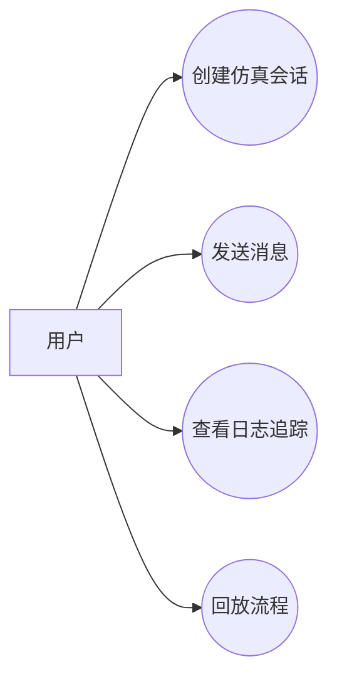
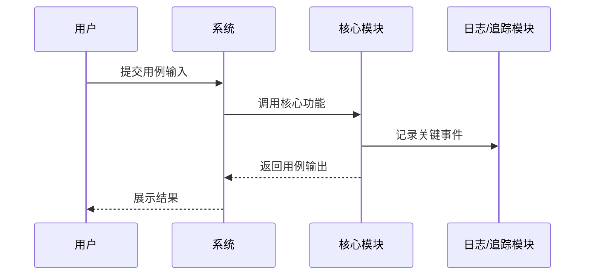

# 一句话生成 TR 设计文档规则

本文件定义 skill 的生成逻辑。模板负责章节结构，生成逻辑负责把一句话扩写成完整 Markdown 文本。

## 1. 模板 + 生成

错误方式：

```md
| 项目名称 | {{项目名称}} |
| 目标用户 | {{目标用户}} |
```

正确方式：

```md
| 项目名称 | AgentNetworkSimulation |
| 目标用户 | 开发者、测试人员、系统设计人员 |
```

如果信息不确定，也不能保留占位符，应写成设计假设、约束说明或风险。

## 2. 输出格式

默认输出为 Markdown 文本。

要求：

- 直接输出 `.md` 内容。
- 使用 Markdown 标题、段落、表格、代码块。
- Mermaid 图使用 ` ```mermaid ` 代码块。
- 不默认生成 Word、PDF、PPT、JSON 或 YAML。
- 不只输出目录或字段说明。
- 不输出空表格或占位符。

## 3. 输入解析

用户输入通常只有一句话：

```text
生成 TR1 设计文档：开发 AgentNetworkSimulation，用于模拟多个 agent 之间的消息协作、日志追踪和流程回放。
```

生成时需要在内部抽取项目名称、项目类型、核心目标、关键能力、目标用户和 TR 阶段，但最终 TR1 正文不输出提示词、原始输入或需求解析章节。

## 4. TR1 核心结构

TR1 设计文档必须包含以下章节：

| 章节 | 内容要求 |
|---|---|
| 项目背景 | 为什么做、当前问题、痛点、价值 |
| 项目目标 | 总体目标、阶段目标、成功标准、非目标 |
| 用例分析 | 用户角色、用例清单、用例图、核心用例说明、时序图 |
| 功能分析 | 功能清单、功能分组、功能边界、输入输出、验收口径 |
| 设计范围 | 范围内、范围外、边界、约束 |
| 概念方案 | 系统边界、核心流程、概念模块、上下文关系 |
| 概念可行性 | 判断需求、范围、用户价值、实现条件和验证条件是否具备 |
| 风险清单 | 风险描述、影响、等级、应对措施 |

## 5. 用例说明固定格式

TR1 的核心用例说明必须使用以下固定字段：

| 项目 | 内容 |
|---|---|
| 用户目的 | 用户希望通过该用例达成的目的 |
| 参与人员 | 参与该用例的人、角色或外部系统 |
| 前置条件 | 执行用例前必须满足的条件 |
| 用例输入 | 用户输入、系统输入或触发数据 |
| 用例流程 | 从触发到输出的主要步骤，可使用 `<br>` 表达多步 |
| 用例输出 | 系统输出、用户可见结果或状态变化 |
| 功能调用 | 该用例涉及的功能模块或功能编号，如 FR-001、FR-002 |

不再使用“用例目标 / 参与角色 / 主流程 / 异常流程 / 后置结果”作为 TR1 核心用例说明的标准字段。

## 6. TR1 禁止技术选型

TR1 不应包含具体技术选型。

不得在 TR1 中确定或推荐：

- 编程语言
- Web 框架
- 数据库
- 消息队列
- 容器 / 编排方案
- 云服务厂商
- 具体观测框架
- 具体存储中间件

TR1 可以写：

- 当前需求是否清晰
- 用户价值是否成立
- 功能范围是否可控
- 实现条件是否具备
- 验证方式是否可行
- 哪些技术问题需要在 TR3/TR4 阶段进一步明确

## 7. Mermaid 图要求

TR1 文档必须包含 Mermaid 用例图和时序图。

### 7.1 用例图



### 7.2 时序图



## 8. 扩写维度

生成文档时至少从以下维度扩写：

| 维度 | 扩写方式 |
|---|---|
| 背景 | 为什么要做、当前痛点、目标价值 |
| 目标 | 总体目标、阶段目标、成功标准、非目标 |
| 用例 | 用户角色、用例清单、固定格式用例说明、Mermaid 图 |
| 功能 | 初步功能清单、优先级、边界、输入输出、验收口径 |
| 非功能 | 性能、可靠性、安全、可维护性、可观测性 |
| 概念方案 | 系统边界、核心流程、概念模块、上下文关系 |
| 可行性 | 需求可行性、价值可行性、范围可控性、实现条件、验证条件 |
| 风险 | 风险描述、影响、概率、等级、应对措施 |
| 结论 | 是否进入下一阶段、进入条件、下一步动作 |

## 9. TR 阶段差异

| 阶段 | 扩写重点 | 避免事项 |
|---|---|---|
| TR1 | 项目背景、项目目标、用例分析、功能分析、概念方案、概念可行性 | 不写代码级接口、数据库表、技术选型 |
| TR2 | 需求分解、规格、验收、追踪矩阵 | 不急于决定详细架构 |
| TR3 | 架构、模块、数据流、技术路线 | 不写过细实现代码 |
| TR4 | 接口、数据结构、状态机、异常处理、技术选型 | 不停留在概念层 |
| TR5 | 测试策略、验证场景、质量门禁 | 不只列测试标题 |
| TR6 | 发布、交付、运维、回滚、监控 | 不只写上线计划 |

## 10. 最终输出禁用项

最终生成文档中不得出现：

- `{{...}}`
- `xxx`
- `TODO`
- `待填写`
- 空表格
- 只有标题没有内容的章节
- TR1 中出现具体技术选型建议
- TR1 中出现提示词、输入解析、待确认问题或投入分析章节

## 11. 最终输出要求

最终文档应该满足：

- 用户可以直接复制到 Markdown 文件中。
- 每个表格都有具体内容。
- Mermaid 图可以被支持 Mermaid 的 Markdown 渲染器渲染。
- 所有推断都标注为设计假设、约束说明或风险。
- TR1 只做概念设计和可行性判断，不做技术选型。
- 核心用例说明使用“用户目的、参与人员、前置条件、用例输入、用例流程、用例输出、功能调用”的固定格式。
- 文档不是问卷，也不是模板说明，而是一份完整设计文档。
