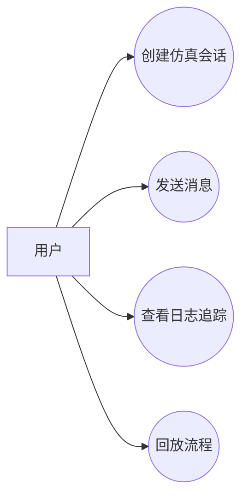
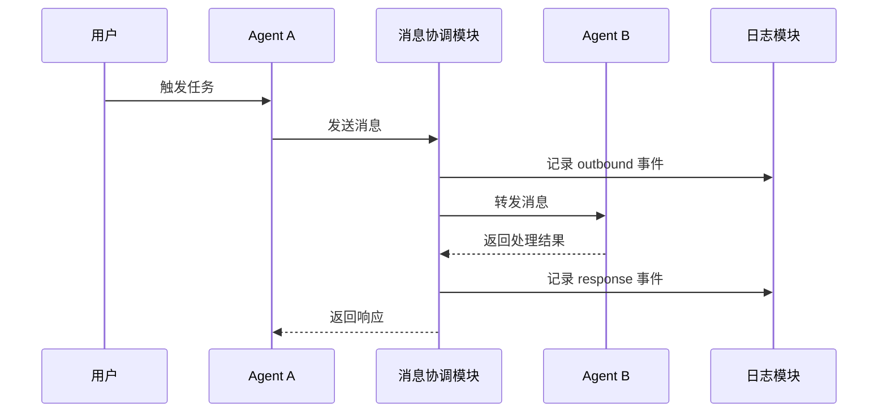

# 一句话生成 TR 设计文档规则

本文件定义 skill 的生成逻辑。模板负责章节结构，生成逻辑负责把一句话扩写成完整 Markdown 文本。

## 1. 模板 + 生成

错误方式：

```md
| 项目名称 | {{项目名称}} |
| 目标用户 | {{目标用户}} |
```

正确方式：

```md
| 项目名称 | AgentNetworkSimulation |
| 目标用户 | 开发者、测试人员、系统设计人员 |
```

如果信息不确定，也不能保留占位符，应写成设计假设或待确认问题。

## 2. 输出格式

默认输出为 Markdown 文本。

要求：

- 直接输出 `.md` 内容。
- 使用 Markdown 标题、段落、表格、代码块。
- Mermaid 图使用 ` ```mermaid ` 代码块。
- 不默认生成 Word、PDF、PPT、JSON 或 YAML。
- 不只输出目录或字段说明。
- 不输出空表格或占位符。

## 3. 输入解析

用户输入通常只有一句话：

```text
生成 TR1 设计文档：开发 AgentNetworkSimulation，用于模拟多个 agent 之间的消息协作、日志追踪和流程回放。
```

需要抽取：

| 字段 | 示例 |
|---|---|
| TR 阶段 | TR1 |
| 项目名称 | AgentNetworkSimulation |
| 项目类型 | 多 agent 消息协作仿真平台 |
| 核心目标 | 模拟 agent 消息协作过程 |
| 关键能力 | 消息协作、日志追踪、流程回放 |
| 目标用户 | 开发者、测试人员、系统设计人员 |

## 4. TR1 核心结构

TR1 设计文档必须包含以下章节：

| 章节 | 内容要求 |
|---|---|
| 项目背景 | 为什么做、当前问题、痛点、价值 |
| 项目目标 | 总体目标、阶段目标、成功标准、非目标 |
| 用例分析 | 用户角色、用例清单、用例图、核心用例、时序图 |
| 功能分析 | 功能清单、功能分组、功能边界、输入输出、验收口径 |

## 5. Mermaid 图要求

TR1 文档必须包含 Mermaid 用例图和时序图。

### 5.1 用例图

使用 Mermaid `flowchart` 表达用例图：



### 5.2 时序图

使用 Mermaid `sequenceDiagram` 表达核心流程：



## 6. 生成设计假设

当用户没有提供完整信息时，需要主动补充合理假设，并清楚标注。

示例：

```md
> 设计假设：系统首期面向研发和测试环境，优先支持本地运行或 Docker Compose 部署，暂不作为公网生产服务。
```

## 7. 扩写维度

生成文档时至少从以下维度扩写：

| 维度 | 扩写方式 |
|---|---|
| 背景 | 为什么要做、当前痛点、目标价值 |
| 目标 | 总体目标、阶段目标、成功标准、非目标 |
| 用例 | 用户角色、用例清单、主流程、异常流程、Mermaid 图 |
| 功能 | 初步功能清单、优先级、边界、输入输出、验收口径 |
| 非功能 | 性能、可靠性、安全、可维护性、可观测性 |
| 方案 | 模块、流程、数据、依赖、可行性 |
| 风险 | 风险描述、影响、概率、等级、应对措施 |
| 问题 | 待确认问题、影响、责任人、关闭条件 |
| 结论 | 是否进入下一阶段、进入条件、下一步动作 |

## 8. TR 阶段差异

| 阶段 | 扩写重点 | 避免事项 |
|---|---|---|
| TR1 | 项目背景、项目目标、用例分析、功能分析、概念方案、可行性 | 不写代码级接口和数据库表 |
| TR2 | 需求分解、规格、验收、追踪矩阵 | 不急于决定详细架构 |
| TR3 | 架构、模块、数据流、技术路线 | 不写过细实现代码 |
| TR4 | 接口、数据结构、状态机、异常处理 | 不停留在概念层 |
| TR5 | 测试策略、验证场景、质量门禁 | 不只列测试标题 |
| TR6 | 发布、交付、运维、回滚、监控 | 不只写上线计划 |

## 9. 最终输出禁用项

最终生成文档中不得出现：

- `{{...}}`
- `xxx`
- `TODO`
- `待填写`
- 空表格
- 只有标题没有内容的章节

## 10. 最终输出要求

最终文档应该满足：

- 用户可以直接复制到 Markdown 文件中。
- 每个表格都有具体内容。
- Mermaid 图可以被支持 Mermaid 的 Markdown 渲染器渲染。
- 所有推断都标注为假设。
- 所有不确定项都进入待确认问题。
- 文档不是问卷，也不是模板说明，而是一份完整设计文档。
