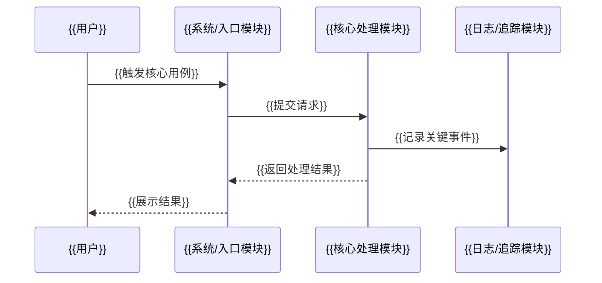

# {{项目名称}} TR1-TR6 阶段设计文档包

> 文档类型：TR1-TR6 阶段设计文档包  
> 输出格式：Markdown 文本  
> 适用场景：需要一次性规划或生成项目从概念设计到发布交付的完整 TR 阶段文档结构。  
> 说明：本文档包用于组织 TR1-TR6 六个阶段的设计文档。各阶段应保持边界清晰，不应把后续阶段内容提前写入前序阶段。

## 1. 文档包信息

| 项目 | 内容 |
|---|---|
| 项目名称 | {{项目名称}} |
| 文档包版本 | V0.1 |
| 文档状态 | 草稿 / 待完善 |
| 作者 | {{作者}} |
| 创建日期 | {{创建日期}} |
| 最近更新 | {{最近更新}} |

## 2. 文档包说明

### 2.1 目的

{{说明为什么需要生成 TR1-TR6 阶段设计文档包，以及该文档包服务于什么项目目标。}}

### 2.2 阶段边界原则

| 阶段 | 文档名称 | 阶段重点 | 不应包含 |
|---|---|---|---|
| TR1 | 产品概念与可行性设计文档 | 项目背景、项目目标、用例分析、功能分析、设计范围、产品概念、概念可行性 | 提示词、需求解析、待确认问题、投入分析、具体技术选型、代码级设计 |
| TR2 | 需求分解与规格设计文档 | 需求分解、规格定义、验收口径、需求追踪 | 过早进入详细架构和技术选型 |
| TR3 | 总体方案与概要设计文档 | 系统架构、模块划分、关键流程、技术路线 | 代码级细节、完整接口字段、数据库表结构 |
| TR4 | 详细设计与模块设计文档 | 模块设计、接口设计、数据结构、异常处理、技术选型 | 只停留在概念层 |
| TR5 | 集成验证与测试设计文档 | 测试策略、验证场景、质量门禁、缺陷闭环 | 只列测试标题、不定义验证标准 |
| TR6 | 发布交付与运维设计文档 | 发布、交付、运维、监控、回滚、遗留风险 | 只写上线计划、不写运维和回滚 |

## 3. TR1 产品概念与可行性设计文档

> TR1 只做概念设计与可行性判断，不做具体技术选型。

### 3.1 文档信息

| 项目 | 内容 |
|---|---|
| 项目名称 | {{项目名称}} |
| 文档编号 | {{TR1文档编号}} |
| 文档版本 | V0.1 |
| 文档状态 | 草稿 / 待完善 |
| 设计阶段 | TR1 概念设计 |

### 3.2 项目背景

#### 3.2.1 背景说明

{{说明项目背景、用户痛点、当前问题和机会点。}}

#### 3.2.2 当前问题

| 编号 | 问题 | 影响 | 当前解决方式 | 是否必须解决 |
|---|---|---|---|---|
| P-001 | {{问题}} | {{影响}} | {{当前解决方式}} | 是 / 否 |

#### 3.2.3 项目价值

| 价值编号 | 价值描述 | 受益对象 | 衡量方式 |
|---|---|---|---|
| V-001 | {{价值描述}} | {{受益对象}} | {{衡量方式}} |

### 3.3 项目目标

#### 3.3.1 总体目标

{{说明项目总体目标。}}

#### 3.3.2 阶段目标

| 目标编号 | 目标描述 | 衡量指标 | 优先级 |
|---|---|---|---|
| G-001 | {{目标描述}} | {{衡量指标}} | P0 / P1 / P2 |

#### 3.3.3 成功标准

| 标准编号 | 成功标准 | 验收方式 |
|---|---|---|
| SC-001 | {{成功标准}} | {{验收方式}} |

#### 3.3.4 非目标

| 编号 | 非目标项 | 原因 |
|---|---|---|
| NG-001 | {{非目标项}} | {{原因}} |

### 3.4 用例分析

#### 3.4.1 用户角色

| 角色编号 | 用户角色 | 核心诉求 | 使用场景 | 成功标准 |
|---|---|---|---|---|
| A-001 | {{用户角色}} | {{核心诉求}} | {{使用场景}} | {{成功标准}} |

#### 3.4.2 用例清单

| 用例编号 | 用例名称 | 参与角色 | 触发条件 | 前置条件 | 后置结果 | 优先级 |
|---|---|---|---|---|---|---|
| UC-001 | {{用例名称}} | {{角色}} | {{触发条件}} | {{前置条件}} | {{后置结果}} | P0 |

#### 3.4.3 Mermaid 用例图

```mermaid
flowchart LR
  User[{{用户角色}}]
  UC1(({{核心用例1}}))
  UC2(({{核心用例2}}))
  UC3(({{核心用例3}}))
  UC4(({{核心用例4}}))
  User --> UC1
  User --> UC2
  User --> UC3
  User --> UC4
```

#### 3.4.4 核心用例说明

| 项目 | 内容 |
|---|---|
| 用例目标 | {{用例目标}} |
| 参与角色 | {{参与角色}} |
| 前置条件 | {{前置条件}} |
| 主流程 | {{步骤1}}<br>{{步骤2}}<br>{{步骤3}} |
| 异常流程 | {{异常场景1}}<br>{{异常场景2}} |
| 后置结果 | {{后置结果}} |
| 验收口径 | {{验收口径}} |

#### 3.4.5 Mermaid 核心时序图



### 3.5 功能分析

| 功能编号 | 功能名称 | 功能描述 | 关联用例 | 优先级 | 初步验收口径 |
|---|---|---|---|---|---|
| FR-001 | {{功能名称}} | {{功能描述}} | UC-001 | P0 | {{验收口径}} |

### 3.6 设计范围

| 编号 | 范围项 | 说明 |
|---|---|---|
| S-001 | {{范围项}} | {{说明}} |

### 3.7 产品概念设计

{{说明产品 / 系统概念、核心流程、系统边界和概念方案。}}

### 3.8 概念可行性与实现条件分析

| 维度 | 可行性判断 | 判断依据 | 主要风险 | 应对措施 |
|---|---|---|---|---|
| 需求可行性 | 高 / 中 / 低 | {{依据}} | {{风险}} | {{措施}} |
| 用户价值可行性 | 高 / 中 / 低 | {{依据}} | {{风险}} | {{措施}} |
| 范围可控性 | 高 / 中 / 低 | {{依据}} | {{风险}} | {{措施}} |
| 实现条件可行性 | 高 / 中 / 低 | {{依据}} | {{风险}} | {{措施}} |
| 验证可行性 | 高 / 中 / 低 | {{依据}} | {{风险}} | {{措施}} |

### 3.9 风险清单

| 风险编号 | 风险描述 | 影响 | 概率 | 等级 | 应对措施 | 责任人 | 状态 |
|---|---|---|---|---|---|---|---|
| R-001 | {{风险描述}} | {{影响}} | 高 / 中 / 低 | 高 / 中 / 低 | {{应对措施}} | 待定 | Open |

### 3.10 TR1 设计结论与下一步

| 结论项 | 内容 |
|---|---|
| 设计结论 | 当前概念设计可进入下一阶段 / 需补充后进入下一阶段 / 暂缓 |
| 是否进入 TR2 | 是 / 否 |
| 进入条件 | {{进入条件}} |
| 遗留风险 | {{遗留风险}} |
| 下一步动作 | {{下一步动作}} |

## 4. TR2 需求分解与规格设计文档

### 4.1 需求范围

| 类型 | 内容 | 说明 |
|---|---|---|
| 范围内需求 | {{范围内需求}} | {{说明}} |
| 范围外需求 | {{范围外需求}} | {{说明}} |

### 4.2 需求分解

| 业务需求 | 用户需求 | 功能需求 | 非功能需求 | 优先级 | 验收口径 |
|---|---|---|---|---|---|
| BR-001 | UR-001 | FR-001 | NFR-001 | P0 | {{验收口径}} |

### 4.3 规格定义

| 规格编号 | 规格项 | 输入 | 输出 | 约束 | 验收方式 |
|---|---|---|---|---|---|
| SPEC-001 | {{规格项}} | {{输入}} | {{输出}} | {{约束}} | {{验收方式}} |

### 4.4 需求追踪矩阵

| 业务需求 | 用户需求 | 功能需求 | 设计项 | 测试项 |
|---|---|---|---|---|
| BR-001 | UR-001 | FR-001 | D-001 | T-001 |

### 4.5 TR2 设计结论与下一步

| 结论项 | 内容 |
|---|---|
| 设计结论 | {{设计结论}} |
| 下一阶段输入 | TR3 总体方案与概要设计 |
| 关键遗留风险 | {{遗留风险}} |

## 5. TR3 总体方案与概要设计文档

### 5.1 总体方案概述

{{说明总体方案、系统边界、关键流程和概要设计原则。}}

### 5.2 系统架构概要

```text
[用户 / 外部系统]
        |
        v
[接入层 / 入口模块]
        |
        v
[核心业务模块]
        |
        +--> [数据 / 状态模块]
        +--> [外部依赖]
        +--> [观测与运维]
```

### 5.3 模块划分

| 模块编号 | 模块名称 | 职责 | 输入 | 输出 | 备注 |
|---|---|---|---|---|---|
| M-001 | {{模块名称}} | {{职责}} | {{输入}} | {{输出}} | {{备注}} |

### 5.4 关键流程

```mermaid
flowchart TD
  A[{{开始}}] --> B[{{核心步骤1}}]
  B --> C[{{核心步骤2}}]
  C --> D[{{结束}}]
```

### 5.5 技术路线待确认项

| 技术路线问题 | 影响 | 承接阶段 |
|---|---|---|
| {{技术路线问题}} | {{影响}} | TR3 / TR4 |

### 5.6 TR3 设计结论与下一步

| 结论项 | 内容 |
|---|---|
| 设计结论 | {{设计结论}} |
| 下一阶段输入 | TR4 详细设计与模块设计 |
| 关键遗留风险 | {{遗留风险}} |

## 6. TR4 详细设计与模块设计文档

### 6.1 模块详细设计

| 模块编号 | 模块名称 | 内部职责 | 输入 | 输出 | 关键处理逻辑 |
|---|---|---|---|---|---|
| M-001 | {{模块名称}} | {{内部职责}} | {{输入}} | {{输出}} | {{关键处理逻辑}} |

### 6.2 接口设计

| 接口编号 | 接口名称 | 调用方 | 提供方 | 输入 | 输出 | 异常 |
|---|---|---|---|---|---|---|
| API-001 | {{接口名称}} | {{调用方}} | {{提供方}} | {{输入}} | {{输出}} | {{异常}} |

### 6.3 数据结构设计

| 数据对象 | 字段 | 类型 | 是否必填 | 说明 |
|---|---|---|---|---|
| {{数据对象}} | {{字段}} | {{类型}} | 是 / 否 | {{说明}} |

### 6.4 异常处理设计

| 异常编号 | 异常场景 | 检测方式 | 处理策略 | 日志等级 |
|---|---|---|---|---|
| E-001 | {{异常场景}} | {{检测方式}} | {{处理策略}} | INFO / WARN / ERROR |

### 6.5 技术选型说明

| 技术项 | 选型 | 选择理由 | 替代方案 | 风险 |
|---|---|---|---|---|
| {{技术项}} | {{选型}} | {{选择理由}} | {{替代方案}} | {{风险}} |

### 6.6 TR4 设计结论与下一步

| 结论项 | 内容 |
|---|---|
| 设计结论 | {{设计结论}} |
| 下一阶段输入 | TR5 集成验证与测试设计 |
| 关键遗留风险 | {{遗留风险}} |

## 7. TR5 集成验证与测试设计文档

### 7.1 验证范围

| 验证范围 | 说明 | 优先级 |
|---|---|---|
| {{验证范围}} | {{说明}} | P0 / P1 / P2 |

### 7.2 测试场景

| 测试编号 | 场景 | 前置条件 | 输入 | 预期结果 | 优先级 |
|---|---|---|---|---|---|
| T-001 | {{场景}} | {{前置条件}} | {{输入}} | {{预期结果}} | P0 |

### 7.3 质量门禁

| 门禁项 | 通过标准 | 阻塞级别 | 责任人 |
|---|---|---|---|
| {{门禁项}} | {{通过标准}} | 阻塞 / 条件阻塞 / 不阻塞 | 待定 |

### 7.4 缺陷闭环

| 缺陷等级 | 定义 | 处理要求 | 关闭标准 |
|---|---|---|---|
| Critical | {{定义}} | {{处理要求}} | {{关闭标准}} |
| Major | {{定义}} | {{处理要求}} | {{关闭标准}} |
| Minor | {{定义}} | {{处理要求}} | {{关闭标准}} |

### 7.5 TR5 设计结论与下一步

| 结论项 | 内容 |
|---|---|
| 设计结论 | {{设计结论}} |
| 下一阶段输入 | TR6 发布交付与运维设计 |
| 关键遗留风险 | {{遗留风险}} |

## 8. TR6 发布交付与运维设计文档

### 8.1 发布范围

| 发布范围 | 内容 | 说明 |
|---|---|---|
| 本次发布包含 | {{发布内容}} | {{说明}} |
| 本次发布不包含 | {{不包含内容}} | {{说明}} |

### 8.2 交付物

| 交付物 | 内容 | 格式 | 验收方式 |
|---|---|---|---|
| {{交付物}} | {{内容}} | {{格式}} | {{验收方式}} |

### 8.3 运维设计

| 运维项 | 说明 | 责任人 | 处理标准 |
|---|---|---|---|
| {{运维项}} | {{说明}} | 待定 | {{处理标准}} |

### 8.4 回滚设计

| 回滚场景 | 触发条件 | 回滚步骤 | 恢复标准 |
|---|---|---|---|
| {{回滚场景}} | {{触发条件}} | {{回滚步骤}} | {{恢复标准}} |

### 8.5 遗留风险闭环

| 风险编号 | 风险描述 | 影响 | 处理策略 | 计划关闭阶段 |
|---|---|---|---|---|
| R-001 | {{风险描述}} | {{影响}} | {{处理策略}} | {{关闭阶段}} |

### 8.6 TR6 设计结论

| 结论项 | 内容 |
|---|---|
| 设计结论 | 可发布 / 有条件发布 / 暂缓发布 |
| 发布条件 | {{发布条件}} |
| 遗留风险 | {{遗留风险}} |
| 下一步动作 | {{下一步动作}} |

## 9. 文档包总览

| 阶段 | 文档状态 | 关键输出 | 下一步 |
|---|---|---|---|
| TR1 | 草稿 / 待完善 / 完成 | 产品概念、用例、功能、概念可行性 | 进入 TR2 |
| TR2 | 草稿 / 待完善 / 完成 | 需求分解、规格、验收、追踪矩阵 | 进入 TR3 |
| TR3 | 草稿 / 待完善 / 完成 | 总体方案、架构、模块、技术路线 | 进入 TR4 |
| TR4 | 草稿 / 待完善 / 完成 | 模块设计、接口、数据结构、异常处理 | 进入 TR5 |
| TR5 | 草稿 / 待完善 / 完成 | 验证设计、测试场景、质量门禁 | 进入 TR6 |
| TR6 | 草稿 / 待完善 / 完成 | 发布交付、运维、回滚、风险闭环 | 发布 / 交付 |
