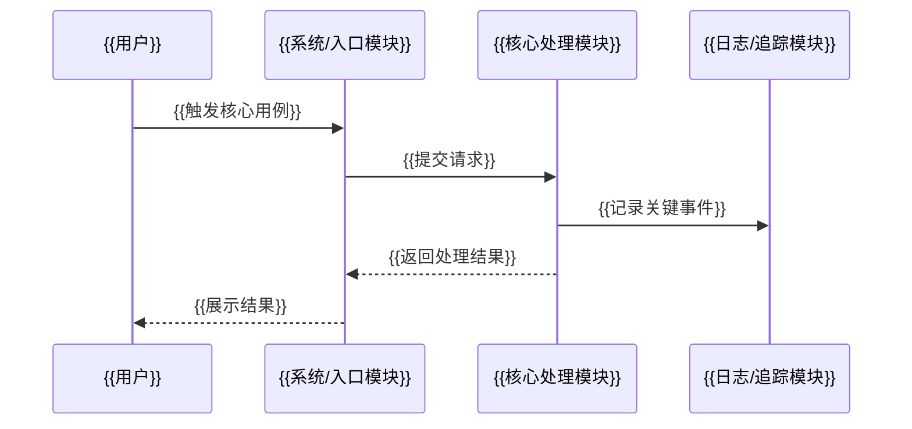

# {{项目名称}} TR1 产品概念与可行性设计文档

> 文档类型：TR1 产品概念与可行性设计文档  
> 输出格式：Markdown 文本  
> 适用阶段：概念阶段 / 立项前后  
> 设计重点：项目背景、项目目标、用例分析、功能分析、产品概念、可行性和初始风险。

## 1. 文档信息

| 项目 | 内容 |
|---|---|
| 项目名称 | {{项目名称}} |
| 文档编号 | {{文档编号 | 待定}} |
| 文档版本 | V0.1 |
| 文档状态 | 草稿 / 待完善 |
| 作者 | {{作者 | 待定}} |
| 设计阶段 | TR1 概念设计 |
| 创建日期 | {{创建日期}} |
| 最近更新 | {{最近更新}} |

## 2. 一句话输入与需求解析

### 2.1 原始输入

```text
{{用户的一句话需求}}
```

### 2.2 需求解析

| 字段 | 解析结果 |
|---|---|
| 项目名称 | {{项目名称}} |
| 项目类型 | {{项目类型}} |
| 目标用户 | {{目标用户}} |
| 核心目标 | {{核心目标}} |
| 关键能力 | {{关键能力}} |
| 主要约束 | {{主要约束}} |

### 2.3 设计假设

> 设计假设：{{基于一句话需求生成合理假设。最终输出中不得保留占位符。}}

## 3. 项目背景

### 3.1 背景说明

{{说明为什么要做该项目，包括业务背景、技术背景、当前痛点和机会点。}}

### 3.2 当前问题

| 编号 | 问题 | 影响 | 当前解决方式 | 是否必须解决 |
|---|---|---|---|---|
| P-001 | {{问题1}} | {{影响}} | {{当前方式}} | 是 / 否 |

### 3.3 项目价值

| 价值编号 | 价值描述 | 受益对象 | 衡量方式 |
|---|---|---|---|
| V-001 | {{价值描述}} | {{受益对象}} | {{衡量方式}} |

## 4. 项目目标

### 4.1 总体目标

{{用 1-3 段说明项目总体目标。}}

### 4.2 阶段目标

| 目标编号 | 目标描述 | 衡量指标 | 优先级 |
|---|---|---|---|
| G-001 | {{目标描述}} | {{衡量指标}} | P0 / P1 / P2 |

### 4.3 成功标准

| 标准编号 | 成功标准 | 验收方式 |
|---|---|---|
| SC-001 | {{成功标准}} | {{验收方式}} |

### 4.4 非目标

| 编号 | 非目标项 | 原因 |
|---|---|---|
| NG-001 | {{本阶段不做的内容}} | {{原因}} |

## 5. 用例分析

### 5.1 用户角色

| 角色编号 | 用户角色 | 核心诉求 | 使用场景 | 成功标准 |
|---|---|---|---|---|
| A-001 | {{用户角色}} | {{核心诉求}} | {{使用场景}} | {{成功标准}} |

### 5.2 用例清单

| 用例编号 | 用例名称 | 参与角色 | 触发条件 | 前置条件 | 后置结果 | 优先级 |
|---|---|---|---|---|---|---|
| UC-001 | {{用例名称}} | {{角色}} | {{触发条件}} | {{前置条件}} | {{后置结果}} | P0 |

### 5.3 Mermaid 用例图

> 生成时使用 Mermaid `flowchart` 表达用例图。

```mermaid
flowchart LR
  User[{{用户角色}}]
  UC1(({{核心用例1}}))
  UC2(({{核心用例2}}))
  UC3(({{核心用例3}}))
  UC4(({{核心用例4}}))
  User --> UC1
  User --> UC2
  User --> UC3
  User --> UC4
```

### 5.4 核心用例说明

#### UC-001 {{核心用例名称}}

| 项目 | 内容 |
|---|---|
| 用例目标 | {{用例目标}} |
| 参与角色 | {{参与角色}} |
| 前置条件 | {{前置条件}} |
| 主流程 | {{步骤1}}<br>{{步骤2}}<br>{{步骤3}} |
| 异常流程 | {{异常场景1}}<br>{{异常场景2}} |
| 后置结果 | {{后置结果}} |
| 验收口径 | {{验收口径}} |

### 5.5 Mermaid 核心时序图

> 生成时至少包含一个核心流程时序图。



## 6. 功能分析

### 6.1 功能清单

| 功能编号 | 功能名称 | 功能描述 | 关联用例 | 优先级 | 初步验收口径 |
|---|---|---|---|---|---|
| FR-001 | {{功能名称}} | {{功能描述}} | UC-001 | P0 | {{验收口径}} |

### 6.2 功能分组

| 功能组 | 包含功能 | 设计说明 |
|---|---|---|
| {{功能组}} | {{功能列表}} | {{设计说明}} |

### 6.3 功能边界

| 功能项 | 范围内 | 范围外 | 说明 |
|---|---|---|---|
| {{功能项}} | {{范围内}} | {{范围外}} | {{说明}} |

### 6.4 输入输出分析

| 功能 | 输入 | 输出 | 关键约束 |
|---|---|---|---|
| {{功能名称}} | {{输入}} | {{输出}} | {{关键约束}} |

### 6.5 初步非功能需求

| 类别 | 指标 / 要求 | 当前设计假设 | 待确认项 |
|---|---|---|---|
| 性能 | {{性能要求}} | {{假设}} | {{待确认}} |
| 可靠性 | {{可靠性要求}} | {{假设}} | {{待确认}} |
| 安全 | {{安全要求}} | {{假设}} | {{待确认}} |
| 可维护性 | {{可维护性要求}} | {{假设}} | {{待确认}} |
| 可观测性 | {{可观测性要求}} | {{假设}} | {{待确认}} |

## 7. 设计范围

### 7.1 范围内

| 编号 | 范围项 | 说明 |
|---|---|---|
| S-001 | {{范围项}} | {{说明}} |

### 7.2 范围外

| 编号 | 范围外项 | 原因 | 后续处理 |
|---|---|---|---|
| O-001 | {{范围外项}} | {{原因}} | {{后续处理}} |

## 8. 产品概念设计

### 8.1 概念设计概述

{{描述系统核心思想、用户如何使用、系统如何产生价值。}}

### 8.2 系统边界

| 边界项 | 范围内 | 范围外 | 说明 |
|---|---|---|---|
| {{边界项}} | {{范围内}} | {{范围外}} | {{说明}} |

### 8.3 核心业务流程

```text
用户输入 / 外部触发
  -> {{步骤1}}
  -> {{步骤2}}
  -> {{步骤3}}
  -> 输出结果 / 设计产物 / 系统动作
```

### 8.4 初步系统上下文

```text
[用户 / 外部系统]
        |
        v
[{{项目名称}}]
        |
        v
[输出物 / 下游系统 / 数据存储]
```

## 9. 可选概念方案对比

| 方案 | 说明 | 优点 | 缺点 | 风险 | 结论 |
|---|---|---|---|---|---|
| 方案 A | {{说明}} | {{优点}} | {{缺点}} | {{风险}} | 推荐 / 备选 / 不推荐 |
| 方案 B | {{说明}} | {{优点}} | {{缺点}} | {{风险}} | 推荐 / 备选 / 不推荐 |

## 10. 技术可行性设计分析

### 10.1 关键技术点

| 技术点 | 可行性判断 | 设计依据 | 风险 | 应对措施 |
|---|---|---|---|---|
| {{技术点}} | 高 / 中 / 低 | {{依据}} | {{风险}} | {{措施}} |

### 10.2 外部依赖

| 依赖项 | 类型 | 当前状态 | 风险 | 责任人 |
|---|---|---|---|---|
| {{依赖项}} | 技术 / 团队 / 平台 / 数据 | 待确认 | {{风险}} | 待定 |

### 10.3 资源可行性

| 资源类型 | 需求 | 当前可用 | 缺口 | 备注 |
|---|---|---|---|---|
| 人力 | {{需求}} | {{可用}} | {{缺口}} | {{备注}} |
| 环境 | {{需求}} | {{可用}} | {{缺口}} | {{备注}} |
| 工具 | {{需求}} | {{可用}} | {{缺口}} | {{备注}} |

## 11. 初步设计演进计划

| 里程碑 | 输出物 | 计划时间 | 依赖 | 风险 |
|---|---|---|---|---|
| M1 概念设计确认 | TR1 设计文档 | {{时间}} | {{依赖}} | {{风险}} |
| M2 需求规格设计 | TR2 设计文档 | {{时间}} | {{依赖}} | {{风险}} |
| M3 概要设计 | TR3 设计文档 | {{时间}} | {{依赖}} | {{风险}} |

## 12. 风险清单

| 风险编号 | 风险描述 | 影响 | 概率 | 等级 | 应对措施 | 责任人 | 状态 |
|---|---|---|---|---|---|---|---|
| R-001 | {{风险描述}} | {{影响}} | 高 / 中 / 低 | 高 / 中 / 低 | {{应对措施}} | 待定 | Open |

## 13. 待确认问题与闭环计划

| 问题编号 | 问题描述 | 影响 | 责任人 | 计划关闭时间 |
|---|---|---|---|---|
| Q-001 | {{待确认问题}} | {{影响}} | 待定 | 待定 |

## 14. TR1 设计检查表

| 检查项 | 是否满足 | 说明 |
|---|---|---|
| 是否包含项目背景 | 是 / 否 / 部分 | {{说明}} |
| 是否包含项目目标 | 是 / 否 / 部分 | {{说明}} |
| 是否包含用例分析 | 是 / 否 / 部分 | {{说明}} |
| 是否包含功能分析 | 是 / 否 / 部分 | {{说明}} |
| 是否包含 Mermaid 用例图 | 是 / 否 / 部分 | {{说明}} |
| 是否包含 Mermaid 时序图 | 是 / 否 / 部分 | {{说明}} |
| 是否形成产品 / 系统概念设计 | 是 / 否 / 部分 | {{说明}} |
| 是否完成初步技术可行性判断 | 是 / 否 / 部分 | {{说明}} |
| 是否识别关键风险和外部依赖 | 是 / 否 / 部分 | {{说明}} |
| 是否明确下一阶段设计输入 | 是 / 否 / 部分 | {{说明}} |

## 15. 设计结论与下一步

| 结论项 | 内容 |
|---|---|
| 设计结论 | 当前概念设计可进入下一阶段 / 需补充后进入下一阶段 / 暂缓 |
| 是否进入 TR2 | 是 / 否 |
| 进入条件 | {{条件}} |
| 遗留问题 | {{遗留问题}} |
| 下一步动作 | {{下一步动作}} |
